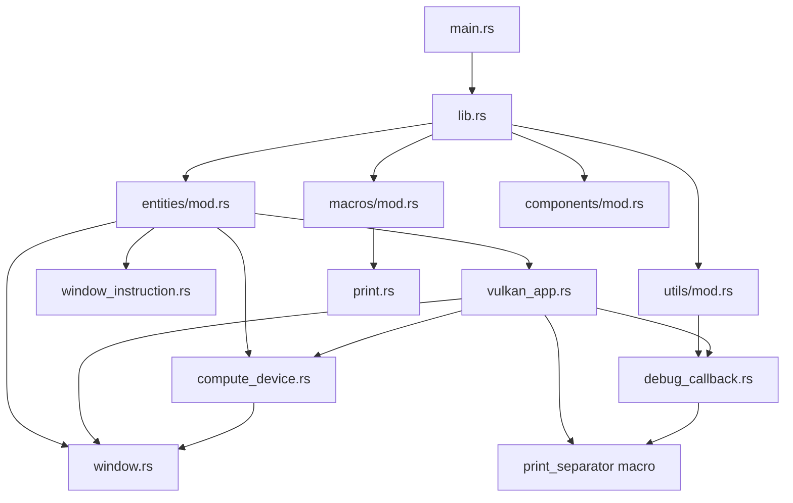
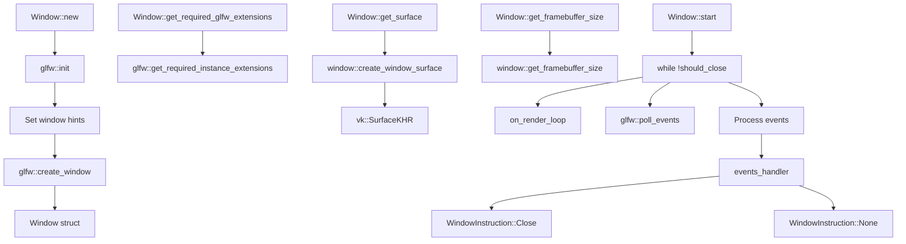
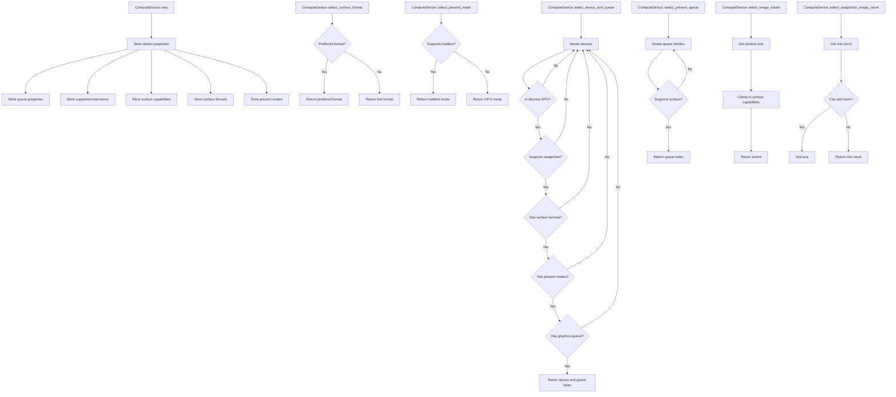
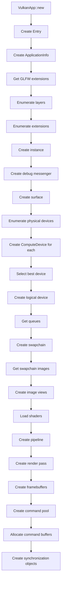
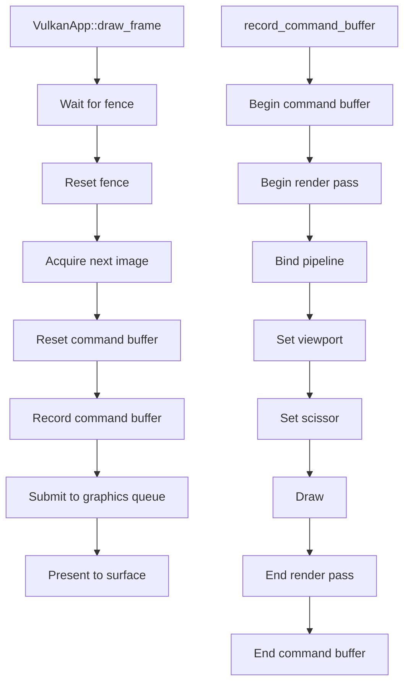
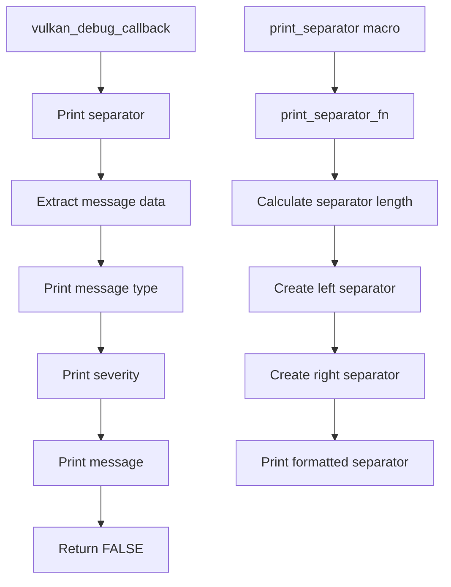
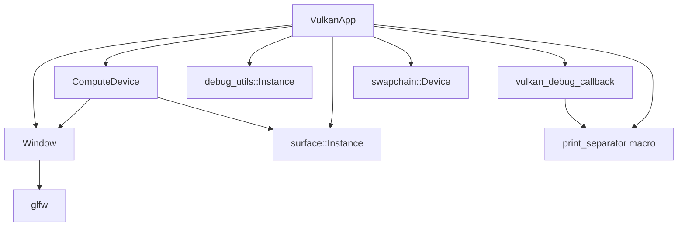
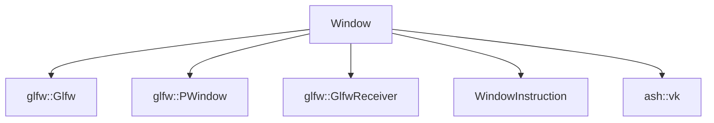
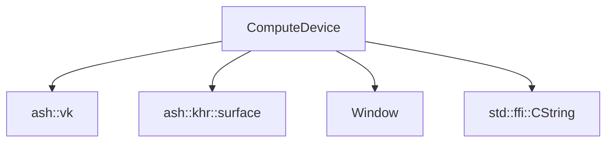

# Vulkan Engine

A Rust-based Vulkan graphics engine that demonstrates the complete Vulkan initialization pipeline, from instance creation to rendering a triangle.

## Project Structure

```
vulkan_engine/
├── Cargo.toml
├── compile_shaders.sh
└── src/
    ├── main.rs              # Application entry point
    ├── lib.rs               # Library module declarations
    ├── entities/            # Core Vulkan entities
    │   ├── mod.rs
    │   ├── window.rs        # GLFW window management
    │   ├── window_instruction.rs
    │   ├── vulkan_app.rs    # Main Vulkan application
    │   └── compute_device.rs # Physical device selection
    ├── utils/               # Utility functions
    │   ├── mod.rs
    │   └── debug_callback.rs
    ├── macros/              # Custom macros
    │   ├── mod.rs
    │   └── print.rs
    ├── components/          # (Empty - for future use)
    │   └── mod.rs
    └── shaders/             # GLSL shaders
        ├── shader.vert
        ├── shader.vert.spv
        ├── shader.frag
        └── shader.frag.spv
```

## Dependencies

### External Dependencies
- **ash**: Vulkan bindings for Rust
- **glfw**: Window management and surface creation

### Internal Dependencies



## Function Call Flowcharts

### 1. Application Initialization Flow

```mermaid
flowchart TD
    A[main] --> B[Window::new]
    B --> C[glfw::init]
    B --> D[glfw::create_window]
    B --> E[Window struct created]
    
    A --> F[VulkanApp::new]
    F --> G[Entry::linked]
    F --> H[Create ApplicationInfo]
    F --> I[Get GLFW extensions]
    F --> J[Enumerate layers]
    F --> K[Enumerate extensions]
    F --> L[Create Vulkan instance]
    F --> M[Create debug messenger]
    F --> N[Create surface]
    F --> O[Enumerate physical devices]
    F --> P[ComputeDevice::new for each device]
    F --> Q[ComputeDevice::select_device_and_queue]
    F --> R[ComputeDevice::select_present_queue]
    F --> S[Create logical device]
    F --> T[Get graphics and present queues]
    F --> U[Create swapchain]
    F --> V[Create image views]
    F --> W[Load shaders]
    F --> X[Create pipeline]
    F --> Y[Create framebuffers]
    F --> Z[Create command pool and buffers]
    F --> AA[Create synchronization objects]
    
    A --> BB[Window::start]
    BB --> CC[Render loop]
    CC --> DD[VulkanApp::draw_frame]
    DD --> EE[Wait for fence]
    DD --> FF[Acquire next image]
    DD --> GG[Record command buffer]
    DD --> HH[Submit to graphics queue]
    DD --> II[Present to surface]
```



### 2. Window Management Flow



### 3. Physical Device Selection Flow



### 4. Vulkan App Initialization Flow



### 5. Rendering Pipeline Flow



### 6. Debug Callback Flow



## Class Dependencies

### VulkanApp Dependencies


### Window Dependencies


### ComputeDevice Dependencies


## Function Call Hierarchy

### Main Entry Point
```
main()
├── Window::new()
│   ├── glfw::init()
│   ├── glfw::create_window()
│   └── Window struct
├── VulkanApp::new()
│   ├── Entry::linked()
│   ├── Create ApplicationInfo
│   ├── Window::get_required_glfw_extensions()
│   ├── Enumerate layers/extensions
│   ├── Create Vulkan instance
│   ├── Create debug messenger
│   ├── Window::get_surface()
│   ├── Enumerate physical devices
│   ├── ComputeDevice::new() for each device
│   ├── ComputeDevice::select_device_and_queue()
│   ├── ComputeDevice::select_present_queue()
│   ├── Create logical device
│   ├── Get queues
│   ├── Create swapchain
│   ├── Create image views
│   ├── Load shaders
│   ├── Create pipeline
│   ├── Create framebuffers
│   ├── Create command pool/buffers
│   └── Create synchronization objects
└── Window::start()
    ├── Render loop
    │   └── VulkanApp::draw_frame()
    │       ├── Wait for fence
    │       ├── Acquire next image
    │       ├── record_command_buffer()
    │       ├── Submit to queue
    │       └── Present
    └── Event handling
```

## Key Features

1. **Complete Vulkan Initialization**: From instance creation to rendering pipeline
2. **Physical Device Selection**: Automatic selection of best available GPU
3. **Surface Management**: GLFW integration for window surface creation
4. **Debug Support**: Vulkan validation layers with custom debug callbacks
5. **Synchronization**: Proper fence and semaphore management
6. **Triangle Rendering**: Basic graphics pipeline with vertex and fragment shaders

## Building and Running

1. **Compile shaders**:
   ```bash
   ./compile_shaders.sh
   ```

2. **Build and run**:
   ```bash
   cargo run
   ```

3. **Exit**: Press ESC key to close the application

## Dependencies Summary

- **ash**: Vulkan API bindings
- **glfw**: Window management and surface creation
- **Custom macros**: Debug output formatting
- **GLSL shaders**: Vertex and fragment shaders for triangle rendering

The engine demonstrates a complete Vulkan graphics pipeline from initialization to rendering, with proper resource management and synchronization. 